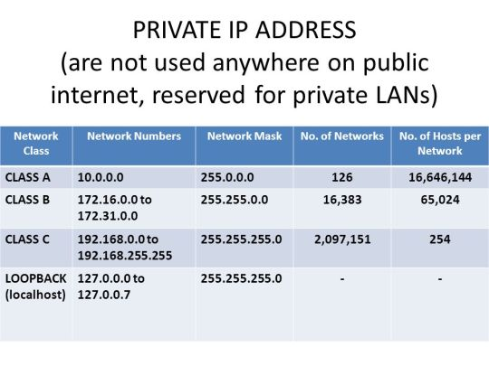

# Ip addresses

`ifconfig` gives us a lot of ip information.

(This is equivalent to `ip a`)

Our ipv4 address is our `inet` (in decimal notation)
and the ipv6 address is our `inet6` (in hex notation).

Ip addresses are on layer 3.

Each ipv4 section is 8 bits long.  
In total an ipv4 address is 32 bits long.

Ipv4 is displayed in decimal for making it human readable.

## How is ipv6 used? It seems it's not

Most people is using ipv4. How is it possible ipv6 is used?

We're using something called NAT (network address translation).

With NAT we're assign private IP addresses.

Private IP addresses like 192.168 or 10. are not used publicly

## Private IP Address classes

</img>
