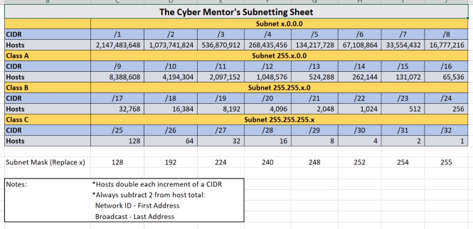

# Subnetting

</img>

*(I don't know how to find the netmask in 255.255.255.0 like format, but I am getting the /24)*

The more 1 bits we have in our subnet, the more hosts we'll have.

For the numbers of hosts, we should always substract 2 from the total.

So, for /24 instead of having 256, we have 254 hosts.

**Network ID** is the first address, while **broadcast** is the last address.

## Mini exercise

For the following IPs in CIDR, give the subnet, number of hosts, network id and broadcast.

* 192.168.1.0/24
  * Subnet: 255.255.255.0
  * Hosts: 254
  * Network id: 192.168.1.0
  * Broadcast: 192.168.1.255
* 192.168.1.0/28
  * Subnet: 255.255.255.240
  * Hosts: 14
  * Network id: 192.168.1.0
  * Broadcast: 192.168.1.15
* 192.168.1.16/28
  * Subnet: 255.255.255.240
  * Hosts: 14
  * Network id: 192.168.1.16
  * Broadcast: 192.168.1.31

You can also check your CIDR ip in https://www.ipaddressguide.com/cidr.

* 192.168.0.0/22
  * Subnet: 255.255.252.0
  * Hosts: 1022
  * Network id: 192.168.0.0
  * Broadcast: 192.168.3.255
* 192.168.1.0/26
  * Subnet: 255.255.255.192
  * Hosts: 62
  * Network id: 192.168.1.0
  * Broadcast: 192.168.1.63
* 192.168.1.0/27
  * Subnet: 255.255.255.224
  * Hosts: 30
  * Network id: 192.168.1.0
  * Broadcast: 192.168.1.31
